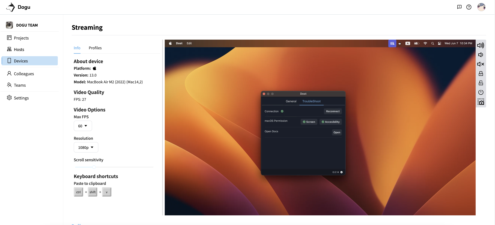
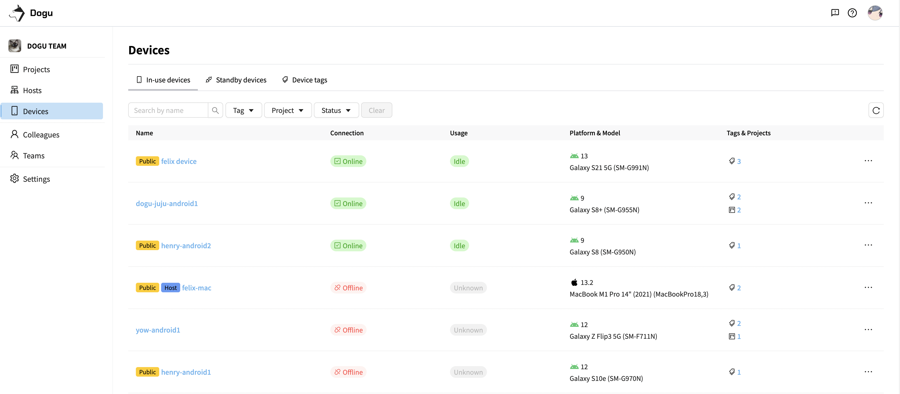
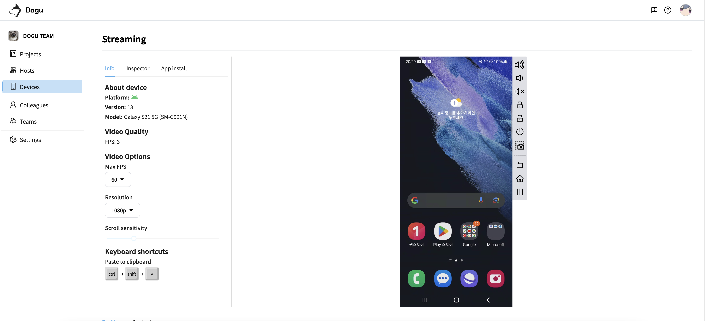
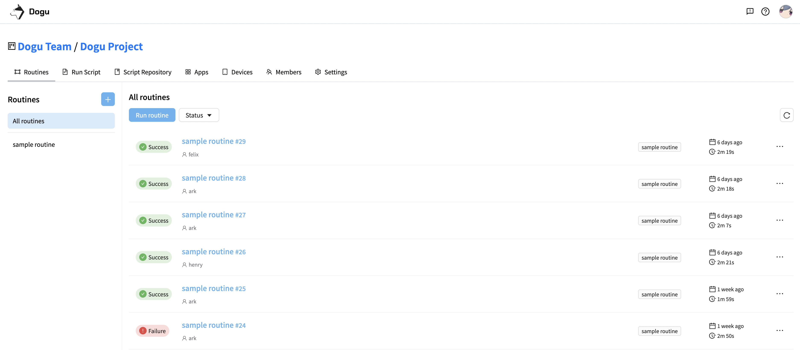
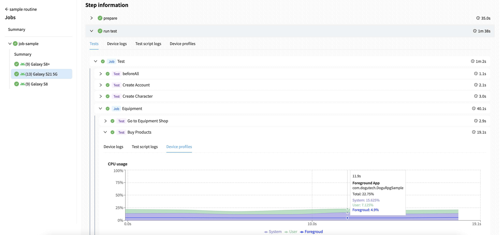

  <b>Dogu</b>

Dogu is an integrated platform for automated testing - TestOps

<a href="https://dogutech.io" target="_blank" rel="noopener noreferrer">Homepage</a> | 
<a href="https://twitter.com/dogutechio" target="_blank" rel="noopener noreferrer">Twitter</a> |
<a href="https://discord.gg/bVycd6Tu9g" target="_blank" rel="noopener noreferrer">Discord</a>

## What is Dogu?

Dogu is an platform which integrates device-farm, CI, test-reporting for automated testing.  
If you use Dogu then you don't need to set up platform like jenkins, device-farm, test-reporting for automated test to Dogu and focus on your test.

## Architecture

- [Gamium](https://github.com/dogu-team/gamium) - SDK that allows you to automate game developed by Unity Engine.

## Features

### [Organization & Project](https://docs.dogutech.io/organization-and-project/introduction)

Manage project, user, device, test script, workflow according to role of organization

  
  

### [Host & Device](https://docs.dogutech.io/host-and-device/introduction)

Build device farm with your own devices

  
  

  

### [Script & Workflow](https://docs.dogutech.io/script-and-routine/introduction)

Integrate test script with workflow and run it on your own device farm

  
  

### [Testing Report](https://docs.dogutech.io/script-and-routine/report)

Visualize test result from workflow

- Profiling device (memory, cpu, fps)
- Recording video
- Visualize test result (test unit)
- Testing script log

  
  

  
  
  

## Hardware requirements

Main Server

|                          | Minimum Requirements   |
| :----------------------: | ---------------------- |
| <b>Operating System</b>  | OS that can run docker |
|       <b> CPU </b>       | 16 Cores               |
|     <b> Memory </b>      | 32 Gb RAM              |
| <b> Free Disk Space </b> | SSD 128Gb              |

Host

|                          | Minimum Requirements |
| :----------------------: | -------------------- |
| <b>Operating System</b>  | Windows, MacOS       |
|       <b> CPU </b>       | 4 Cores              |
|     <b> Memory </b>      | 8 Gb RAM             |
| <b> Free Disk Space </b> | SSD 32Gb             |

## Getting Started (Self-Managed)

We are preparing to make Dogu be open-source project.

## Getting Started (SaaS)

You can start without setting up Dogu by using our [cloud service](https://dogutech.io)

## Resources

[Documentation](https://docs.dogutech.io)
