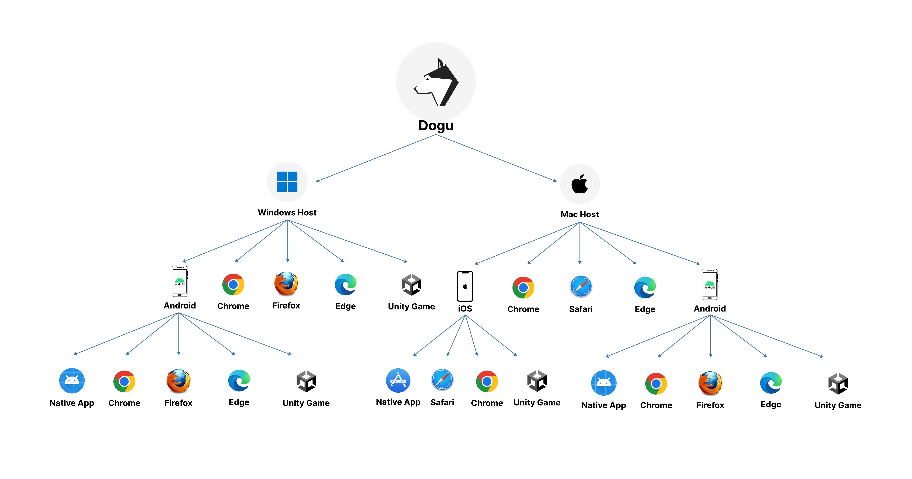
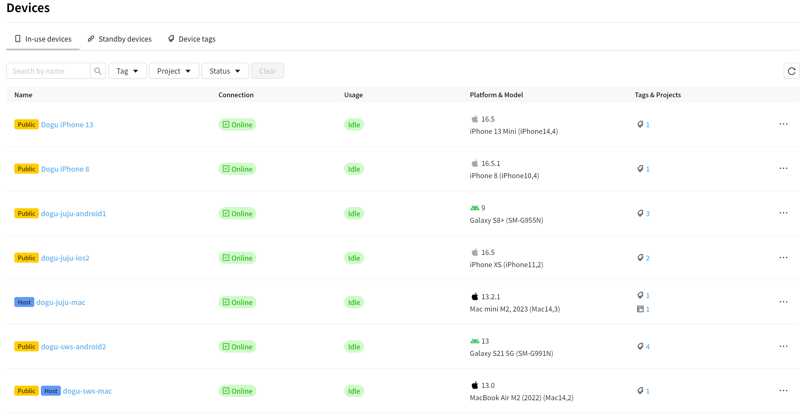

Dogu - Integrated test automation platform based on web.

  
  
  
  
  

    
  
    
    
  

Dogu is an cross E2E test automation platform for web, mobile and game application. You can integrate various tools such as Appium, Selenium and Playwright that you have previously used with Dogu, allowing you to perform parallel processing and check test results more easy. Experience more efficient test automation with Dogu.

## Test Automation Platform

Build a systematic test automation infrastructure using Windows, MacOS, Android, and iOS devices.

## Device Farm

### Control and inspect UI remotely

  
    
  

Build device farm with your own devices and control them in web-page

## Test Automation

Use a variety of test automation frameworks to easily run tests on the device farm.

### Use Dogu With Test Frameworks

- [Appium](https://docs.dogutech.io/get-started/tutorials/appium/)
- [Selenium](https://docs.dogutech.io/get-started/tutorials/selenium/)
- [Webdriverio](https://docs.dogutech.io/get-started/tutorials/webdriverio/)
- [Gamium](https://docs.dogutech.io/get-started/tutorials/gamium/)

## Test Report

Visualize test unit by integrating test unit framework with test report.

### Integrate report with test unit frameworks

- [Jest](https://docs.dogutech.io/test-report/jest)
- [Pytest](https://docs.dogutech.io/test-report/pytest)

## Routine

Use a pipeline to process tests in parallel.

### Integrate routine With CI/CD

- [Github Action](https://docs.dogutech.io/integration/cicd/github)
- [Jenkins](https://docs.dogutech.io/integration/cicd/jenkins)

Create routines to run the tests in parallel.

## Why Dogu?

Building and maintaining infrastructure components such as OpenSTF, Jenkins, and Grafana for test automation requires significant time and effort. However, Dogu streamlines this process by providing an integrated platform for these infrastructures, allowing you to concentrate on test automation itself. Moreover, Dogu offers seamless integration with test scripts and frameworks, eliminating the need to develop infrastructure-related tasks such as parallel test execution and data transfer for test reporting.

## Start With Cloud

Start [cloud service](https://dogutech.io) right now without any installation.

## Start With Self-Hosted

Use Dogu on a self-hosted. See [guide setting up Dogu with self-hosted](https://docs.dogutech.io/get-started/installation/self-hosted/installation) for more details.

## Documentation

- [Documentation](https://docs.dogutech.io)
- [Device Farm](https://docs.dogutech.io/get-started/tutorials/device-farm/)

### Remote

- [Selenium](https://docs.dogutech.io/get-started/tutorials/selenium/)
- [Appium](https://docs.dogutech.io/get-started/tutorials/appium/)
- [WebdriverIO](https://docs.dogutech.io/get-started/tutorials/webdriverio/)
- [Gamium](https://docs.dogutech.io/get-started/tutorials/gamium/)

## Join Our Community

Join our [Slack Community](https://join.slack.com/t/dogu-community/shared_invite/zt-1zespy16o-TgYIureSBI6ma6o_nG3gVw) to engage in discussions about test automation and receive community support.

## Contributing

Do you want to contribute to Dogu? We'd love your help. Dogu is an open source project, built one contribution at a time by users like you. Read [CONTRIBUTING.md](CONTRIBUTING.md) for more details.

## License

We provide community edition and enterprise edition. See [LICENSE](LICENSE.md) for more details.

## Contact

contact@dogutech.io
