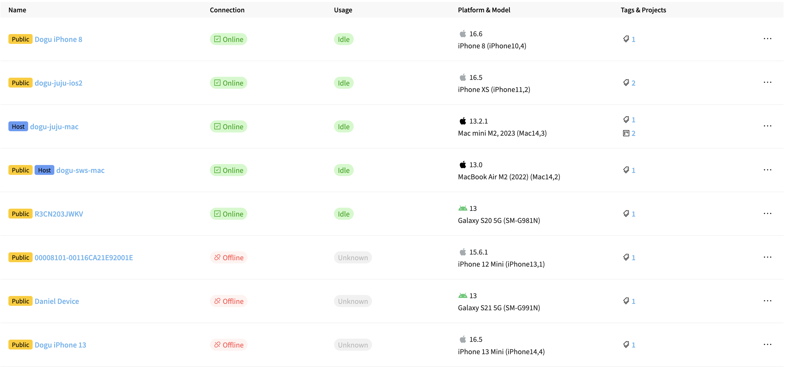
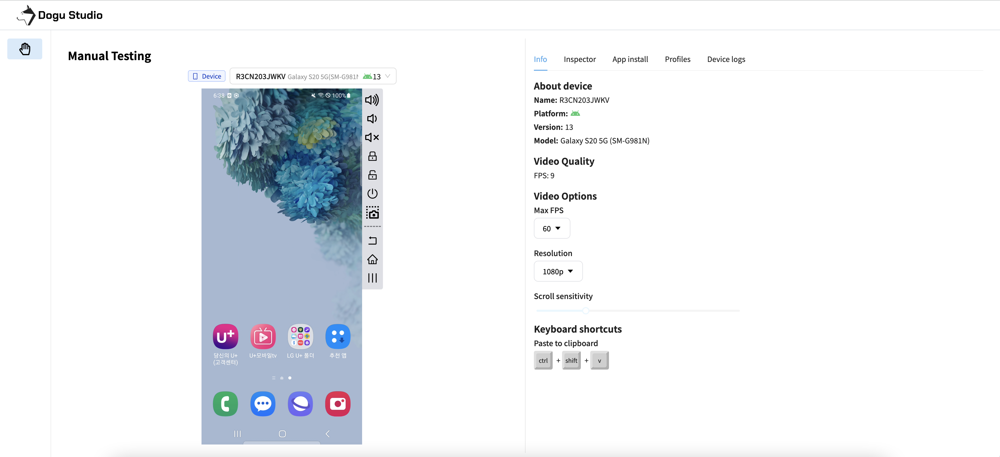
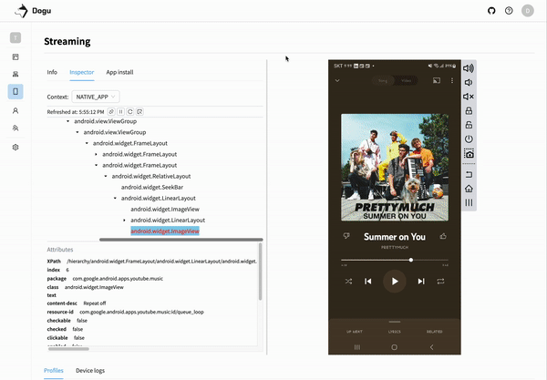
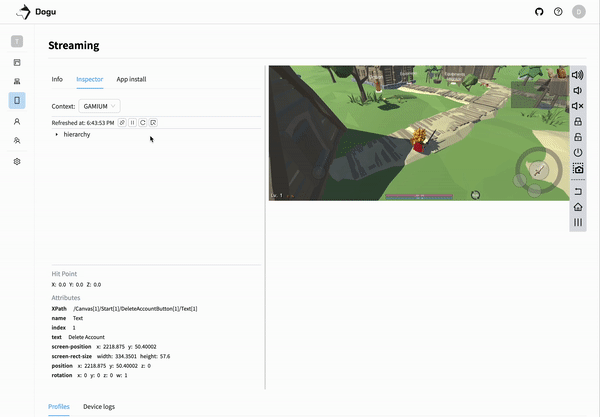
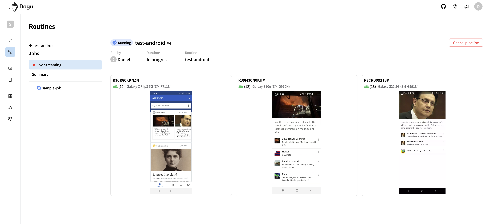

Dogu - Seamless Unified  Test Automation Platform.

We are preparing for re-building project to open source.

# What's Dogu?

Dogu is a seamless unified test automation platform for web, mobile and game application. You can integrate various tools such as Appium, Selenium and Playwright that you have previously used with Dogu, allowing you to perform parallel processing and check test results more easy. Experience more efficient test automation with Dogu.

# Architecture

Dogu is a test automation platform that provides a seamless unified experience for web, mobile and game application. Dogu is composed of the following components.

### Test CI Architecture

# Dogu Features

## Device Farm

Build a systematic device farm with Windows, MacOS, Android, and iOS devices.  
Real devices and emulators are supported.

## Device Studio

Control devices remotely in Device Studio.

### Inspecting UI

Inspect UI with Device Studio.

  
    
  

## Test CI

Run test parallelly and periodically with routine.

## Test Report

Visualize test unit by integrating test unit framework with report.

# Start Dogu

### Run Dogu With Self-Hosted

Use Dogu on a self-hosted. See [guide setting up Dogu with self-hosted](https://docs.dogutech.io/get-started/installation/self-hosted/installation) for more details.

# Documentation

- [Documentation](https://docs.dogutech.io)
- [Tutorial - Device Farm](https://docs.dogutech.io/get-started/tutorials/device-farm/)
- [Tutorial - Appium](https://docs.dogutech.io/get-started/tutorials/test-automation/remote-testing/appium/)
- [Tutorial - Selenium](https://docs.dogutech.io/get-started/tutorials/test-automation/remote-testing/selenium/)
- [Tutorial - Webdriverio](https://docs.dogutech.io/get-started/tutorials/test-automation/remote-testing/webdriverio/)
- [Tutorial - Gamium](https://docs.dogutech.io/get-started/tutorials/test-automation/remote-testing/gamium/)

# RoadMap

- Device Farm (Completed)
- Test Automation
  - Recording Test (Running)
- Test CI
  - Remote
    - Selenium Grid (Completed)
  - Routine
    - Cross Browser - Chrome, Firefox, Safari, Edge (Running)
- Test Report
- Test Auto Recovery

# Contributing

Do you want to contribute to Dogu? We'd love your help. Dogu is an open source project, built one contribution at a time by users like you. Read [CONTRIBUTING.md](CONTRIBUTING.md) for more details.

# License

AGPL-3.0 License
