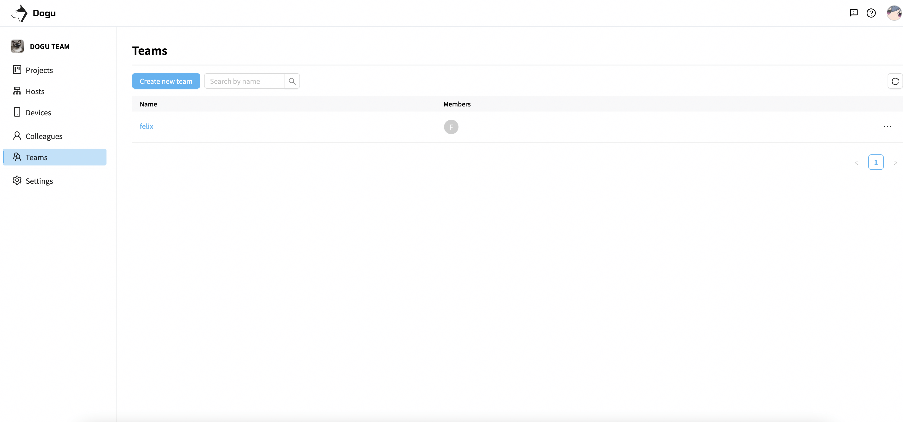
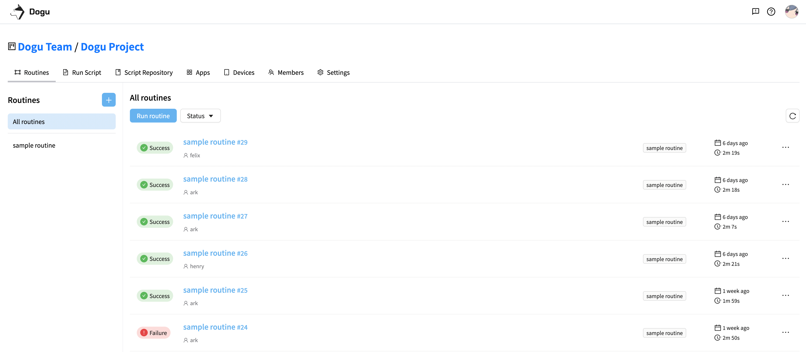

  <b>Dogu</b>

Dogu is a web-based testing platform for test automation

<a href="https://dogutech.io" target="_blank" rel="noopener noreferrer">Homepage</a> | 
<a href="https://twitter.com/dogutechio" target="_blank" rel="noopener noreferrer">Twitter</a> |
<a href="https://discord.gg/bVycd6Tu9g" target="_blank" rel="noopener noreferrer">Discord</a>

## What is Dogu?

Dogu provides device farm, CI, test report for test automation.  
If you use Dogu then you don't need to set up platform like jenkins, device farm, test report for test automation and can focus on your test with Dogu.

## Architecture

- [Gamium](https://github.com/dogu-team/gamium) - Gamium allows you to automate game developed by Unity Engine.

#### Following functions are not supported now but we have plan to support them in the future.
- Test Toolkit - Selenium client  
- Test Framework - Integrate test report with Jest, PyTest  
- Git Server - Integrate with Github  
- Workflow API - for Jenkins and Github Action  

## Features

### [Organization & Project](https://docs.dogutech.io/organization-and-project/introduction)

Manage project, user, device, test script, workflow according to role of organization

- Build systematic organization and project
- Isolate resource like application, device, test script, workflow according to project

  
  

### [Host & Device](https://docs.dogutech.io/host-and-device/introduction)

Build device farm with your own devices

- Manage device farm through dashboard
- Control host and device remotely
- Support many platform devices (Android, iOS, Windows, MacOS)

  
  

  
  
  

### [Inspector](https://docs.dogutech.io/host-and-device/device/streaming-and-remote-control/game-ui-inspector)

Inspect UI of device in web page

- Inspect native UI
- Inspect UI of game developed by Unity Engine

  
  

### [Script & Workflow](https://docs.dogutech.io/script-and-routine/introduction)

Integrate test script with workflow and run it on your own device farm

- Run test script on tartgeted multiple devices
- Integrate workflow with your CI/CD like Jenkins, Github Action
- Import test script from Gitlab, Github
- Parallel test execution

  
  

### [Test Report](https://docs.dogutech.io/script-and-routine/report)

Visualize test result

- Visualized test result (test unit)
- Recorded video
- Profiled device (memory, cpu, fps)
- Log (test script, device, application)

  
  

  
  
  

 

## Why Dogu?
It needs so many time and effort to build and maintain infrastructure like *Appium*, *OpenSTF*, *Jenkins*, *Grafana* for test automation.
Dogu provides **unified platform** for these infrastructure and helps you to focus on test automation.  
Especially, Dogu is tightly integrated with test script and test framework so that you can focus on test automation without developing infrastructure related works like parallel test execution, data transfer for test report.

## Getting Started With Self-Hosted

See [Get Started](https://docs.dogutech.io/self-hosted/get-started) with self-hosted.

## Getting Started With Cloud

You can get started right away with [Cloud Service](https://dogutech.io)

## Documentation

- [Documentation](https://docs.dogutech.io/organization-and-project/organization/about)  
- [Quick Start - Device Farm](https://docs.dogutech.io/get-started/device-farm)  

## Community Support

We love stars so make sure you star ⭐ us on GitHub.

- [Github Discussion](https://github.com/dogu-team/dogu/discussions) - Discussion about product and roadmap
- [Discord](https://discord.gg/bVycd6Tu9g) - Discussion with the community
- [Twitter](https://twitter.com/dogutechio) - Get the latest updates
- [LinkedIn](https://www.linkedin.com/company/dogu-technologies) - Get the latest team updates

## Contributing

Do you want to contribute to Dogu? We'd love your help. Dogu is an open source project, built one contribution at a time by users like you.
See [CONTRIBUTING.md](CONTRIBUTING.md) for more details.

## License

We provide two editions of Dogu: Community Edition and Enterprise Edition.  

See [LICENSE](LICENSE.md) for more details.
