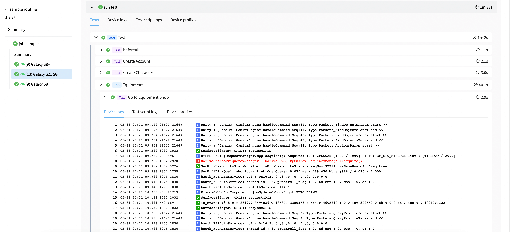
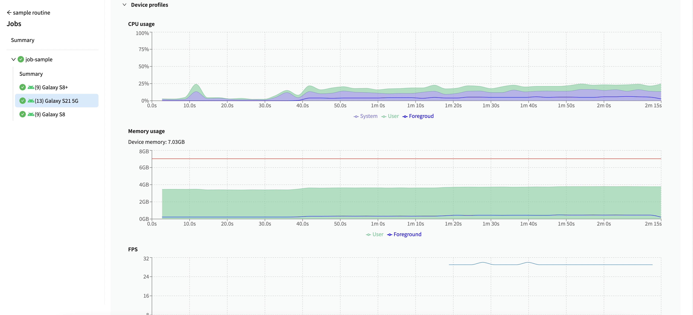

  <a href="https://dogutech.io"><b>Dogu</b></a>

Dogu is a web-based test platform for test automation

  
  
  
  
  
  

  
    
    
  

## What is Dogu?

Dogu provides device farm, CI, test report for test automation.  
If you use Dogu then you don't need to set up platform like jenkins, device farm, test report for test automation and can focus on your test with Dogu.

## Why Dogu?

It needs so many time and effort to build and maintain infrastructure like _Appium_, _OpenSTF_, _Jenkins_, _Grafana_ for test automation.
Dogu provides **integrated platform** for these infrastructure and helps you to focus on test automation.  
Especially, Dogu is tightly integrated with test script and test framework so that you can focus on test automation without developing infrastructure related works like parallel test execution, data transfer for test report.

## Architecture

## Test Automation Flow

### Target Device for Test Script Execution

Dogu Agent helps you to run test script on your own device farm. Especially, Dogu Agent is tightly integrated with test script and test framework so that you can focus on test automation without developing infrastructure related works like, target device for test execution, parallel test execution, pulling test script.

## Platform Features

### [Management](https://docs.dogutech.io/organization-and-project/introduction)

Manage project, user, device, test script, workflow according to role of organization

- Build systematic organization and project
- Isolate resource like application, device, test script, workflow according to project

### [Device Farm](https://docs.dogutech.io/host-and-device/introduction)

Build device farm with your own devices

- Manage device farm through dashboard
- Control host and device remotely
- Support many platform devices (Android, iOS, Windows, MacOS)

  
  

### [UI Inspector](https://docs.dogutech.io/host-and-device/device/streaming-and-remote-control/game-ui-inspector)

Inspect UI of device in web page

- Inspect native UI
- Inspect UI of game developed by Unity Engine

### [Run Test Script](https://docs.dogutech.io/script-and-routine/introduction)

Integrate test script with workflow and run it on your own device farm

- Run test script on tartgeted multiple devices
- Integrate workflow with your CI/CD like Jenkins, Github Action
- Import test script from Gitlab, Github
- Parallel test execution

### [Test Report](https://docs.dogutech.io/script-and-routine/report)

Visualize test result

- Visualized test result (test unit)
- Recorded video
- Profiled device (memory, cpu, fps)
- Log (test script, device, application)

## Integrate Test Script With Dogu

You can integrate existing test script with Dogu.

### Javascript & Typescript

Coming soon. following test client could be integrated with Dogu

**Client**

- Webdriverio
- [Gamium](https://github.com/dogu-team/gamium)

### Python

Coming soon. following test client could be integrated with Dogu

**Client**

- [Gamium](https://github.com/dogu-team/gamium)

## Integrate Test Framework With Dogu

You can integrate existing test framework with Dogu.

### Javascript & Typescript

Coming soon. following test framework could be integrated with Dogu

**Test Framework**

- Jest

### Python

Coming soon. following test framework could be integrated with Dogu

**Test Framework**

- Pytest

## Start With Self-Hosted

You can set up Dogu on your own server.  
See [Guide setting up Dogu with self-hosted](https://docs.dogutech.io/self-hosted/get-started)

## Start With Cloud

You can start right now with [Cloud Service](https://dogutech.io)

## Documentation

- [Documentation](https://docs.dogutech.io)
- [Quick Start - Device Farm](https://docs.dogutech.io/get-started/device-farm)

## Community Support

We love stars so make sure you star ⭐ us on GitHub.

- [Github Discussion](https://github.com/dogu-team/dogu/discussions) - Discussion about product and roadmap
- [Discord](https://discord.gg/bVycd6Tu9g) - Discussion with the community
- [Twitter](https://twitter.com/dogutechio) - Get the latest updates
- [LinkedIn](https://www.linkedin.com/company/dogu-technologies) - Get the latest team updates

## Contributing

Do you want to contribute to Dogu? We'd love your help. Dogu is an open source project, built one contribution at a time by users like you.
See [CONTRIBUTING.md](CONTRIBUTING.md) for more details.

## License

We provide two editions of Dogu: Community Edition and Enterprise Edition.  
Community Edition is free under licensed AGPL-3.0.

See [LICENSE](LICENSE.md) for more details.
