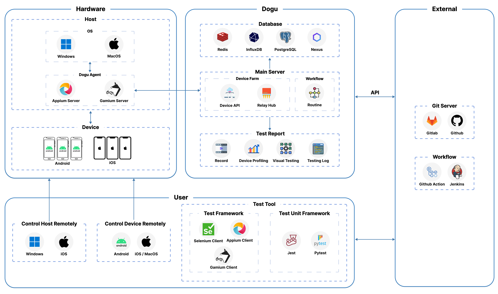

Dogu - Seamless Unified  Test Automation Platform.

  
  
  
  

    
  
    
    
  

# What's Dogu?

Dogu is a seamless unified test automation platform for web, mobile and game application. You can integrate various tools such as Appium, Selenium and Playwright that you have previously used with Dogu, allowing you to perform parallel processing and check test results more easy. Experience more efficient test automation with Dogu.

# Architecture

Dogu is a test automation platform that provides a seamless unified experience for web, mobile and game application. Dogu is composed of the following components.

# Dogu Features

## Device Farm

Build a systematic device farm with Windows, MacOS, Android, and iOS devices.

## Device Studio

Control devices remotely with Device Studio.

### Inspecting UI

Inspect UI with Device Studio.

  
    
  

## Test Report

Visualize test unit by integrating test unit framework with report.

## Test CI

Run test parallelly and periodically with routine.

## Integration

Support various integrations such as Github, Gitlab, Bitbucket, Jenkins, Slack.

# Start Dogu

### With Self-Hosted

Use Dogu on a self-hosted. See [guide setting up Dogu with self-hosted](https://docs.dogutech.io/get-started/installation/self-hosted/installation) for more details.

### With Cloud

Start [cloud service](https://dogutech.io) right now without any installation.

# Documentation

- [Documentation](https://docs.dogutech.io)
- [Tutorial - Device Farm](https://docs.dogutech.io/get-started/tutorials/device-farm/)
- [Tutorial - Appium](https://docs.dogutech.io/get-started/tutorials/test-automation/appium/)
- [Tutorial - Selenium](https://docs.dogutech.io/get-started/tutorials/test-automation/selenium/)
- [Tutorial - Webdriverio](https://docs.dogutech.io/get-started/tutorials/test-automation/webdriverio/)
- [Tutorial - Gamium](https://docs.dogutech.io/get-started/tutorials/test-automation/gamium/)

# RoadMap

- Device Farm (Completed)
- Test Automation
  - Recording Test (Running)
- Test CI
  - Remote
    - Selenium Grid (Completed)
  - Routine
    - Cross Browser - Chrome, Firefox, Safari, Edge (Running)
- Test Report
- Test Auto Recovery

# Join Our Community

Join our [Slack Community](https://join.slack.com/t/dogu-community/shared_invite/zt-1zespy16o-TgYIureSBI6ma6o_nG3gVw) to engage in discussions about test automation and receive community support.

# Contributing

Do you want to contribute to Dogu? We'd love your help. Dogu is an open source project, built one contribution at a time by users like you. Read [CONTRIBUTING.md](CONTRIBUTING.md) for more details.

# License

We provide community edition and enterprise edition. See [LICENSE](LICENSE.md) for more details.

# Contact

contact@dogutech.io
