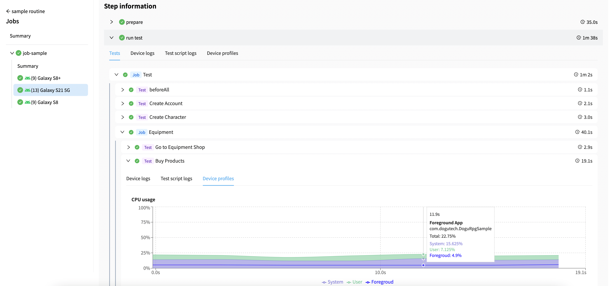

Dogu - Integrated test automation platform based on web.

  
  
  
  
  
  

  
    
    
    
  

Dogu is an integrated test automation platform that simplifies the automation of web, mobile and game application testing.

## Device Farm

Connect the device to run your tests to Device Farm. See [Device Farm](https://docs.dogutech.io/get-started#device-farm) for more details.

### Available Features

- [Remote Interaction](https://docs.dogutech.io/get-started#android-device-interaction)
- [UI Inspector](https://docs.dogutech.io/get-started#android-native-ui-inspector)

## Test Automation

Run test script following test framework on device farm. See [Test Automation](https://docs.dogutech.io/get-started#test-automation) for more details.

### Available Test Framework for Browser

- [Selenium](https://docs.dogutech.io/test-automation/browser/selenium)
- [Playwright](https://docs.dogutech.io/test-automation/browser/playwright)
- [Puppeteer](https://docs.dogutech.io/test-automation/browser/puppeteer)
- [Cypress](https://docs.dogutech.io/test-automation/browser/cypress)
- [Webdriverio](https://docs.dogutech.io/test-automation/browser/webdriverio)

### Available Test Framework for Mobile

- [Appium](https://docs.dogutech.io/test-automation/mobile/appium/)

### Available Test Framework for Game

- [Gamium](https://docs.dogutech.io/test-automation/game/gamium)

## Test Report

Visualize test unit by integrating test unit framework with test report. See [Test Report](https://docs.dogutech.io/get-started#test-reporting) for more details.

### Available Test Unit Framework

- [Jest](https://docs.dogutech.io/test-report/javascript/jest)
- [Pytest](https://docs.dogutech.io/test-report/python/pytest)
- [Mocha](https://docs.dogutech.io/test-report/javascript/mocha)
- [TestNG](https://docs.dogutech.io/test-report/java/testng)

## Test Routine

Run test script by using Workflow. See [Routine](https://docs.dogutech.io/get-started#routine) for more details.

### Available Workflow for Integration

- Jenkins (Not yet supported)
- Github Action (Not yet supported)

## Start With Self-Hosted

Set up Dogu on your own server. See [Guide setting up Dogu with self-hosted](https://docs.dogutech.io/get-started/installation/self-hosted/)

## Start With Cloud

Start [Cloud Service](https://dogutech.io) right now without any installation.

## Documentation

- [Documentation](https://docs.dogutech.io)
- [Tutorial - Browser Test Automation](https://docs.dogutech.io/get-started/tutorials/web)
- [Tutorial - Mobile Test Automation](https://docs.dogutech.io/get-started/tutorials/app)
- [Tutorial - Game Test Automation](https://docs.dogutech.io/get-started/tutorials/game)

## Community Support

We love stars so make sure you star ⭐ us on GitHub.

- [Github Discussion](https://github.com/dogu-team/dogu/discussions) - Discussion about product and roadmap
- [Discord](https://discord.gg/bVycd6Tu9g) - Discussion with the community
- [Twitter](https://twitter.com/dogutechio) - Get the latest updates
- [LinkedIn](https://www.linkedin.com/company/dogu-technologies) - Get the latest team updates

## Contributing

Do you want to contribute to Dogu? We'd love your help. Dogu is an open source project, built one contribution at a time by users like you.
See [CONTRIBUTING.md](CONTRIBUTING.md) for more details.

## License

We provide two editions of Dogu: Community Edition and Enterprise Edition.

See [LICENSE](LICENSE.md) for more details.
