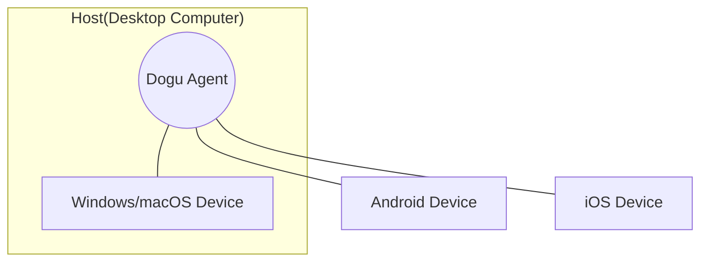

import HostAndAgent from '@site/src/components/device-farm/HostAndAgent.mdx';

Dogu aims to manage devices on various platforms such as Windows, Mac, Android, and iOS in one place.
To realize this, we introduced the concept of `host` and `device`.

### Device {#device}

A `device` means a device with a platform such as Windows, Mac, Android, iOS, etc. Devices are not limited to the Desktop platform. It can be a desktop device or a mobile device.
Anything that can be controlled and orchestrated through software can be considered a device in Dogu.

Currently, Dogu supports Windows, Mac, and Android devices.

<HostAndAgent />

### Diagram

 

:::info
[Start Dogu Agent](host)  
[Set up your device](device/settings)

Check out the above documents to start controlling your device.
:::
