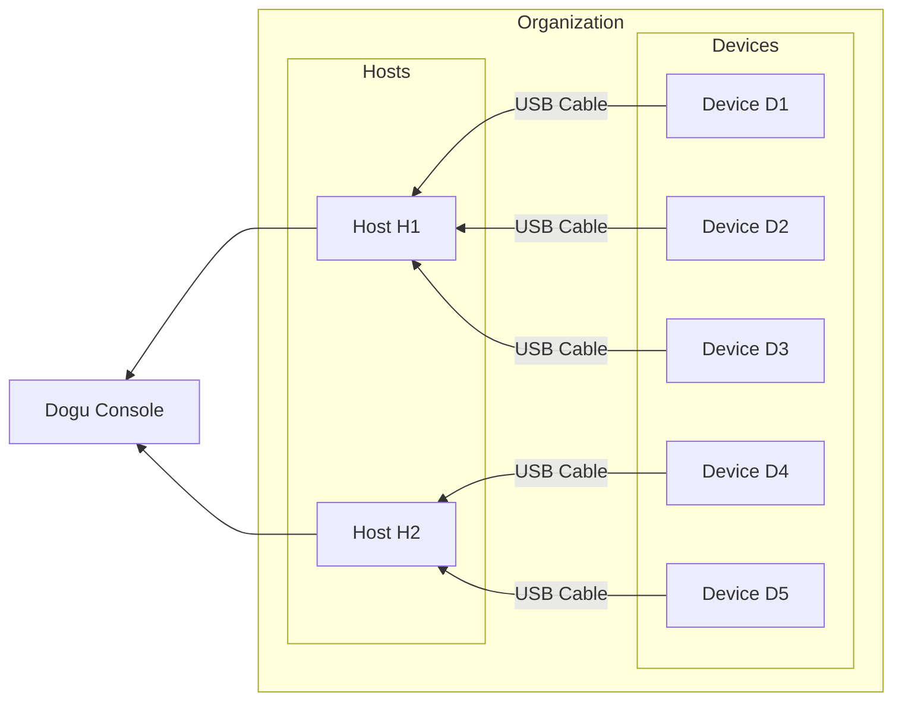

This document explains the process from adding a host to connecting a device.

## Requirements

To execute game testing, you will need the following items:

1. One desktop or laptop with Windows or Mac operating system.
2. One or more Android devices.
3. A USB hub and data transfer cable for Android devices.

## Create organization and project

### Create organization

1. Complete the login process or sign up on the console.
   - If you haven't received email verification, please complete the email verification first.
2. Go to the "My Organization" page.
   - If you are already on the existing organization page, click on the profile image in the top header menu, then click on the "Organizations" menu.
     
3. Click on the "New organization" button.
4. Enter the organization name and complete the creation process.
   

### Create project

1. Click on the "Projects" menu in the left sidebar on the organization page.
2. Click on the "Create project" button.
   
3. Enter the project name and description, and then complete the project creation process.
   

 

:::note

When you create a project, a sample test script environment is provided within the project. You will use this environment in the [Quick start - Game testing](./game-test) step.

:::

## Building Infrastructure

In Dogu, there are **Host** and **Device**.
A host is a device that acts as a hub to apply tests to multiple devices. A device refers to the actual device used for game testing. To connect hosts and devices, please physically connect the actual devices to the host.

This document describes the process based on one host and one device.

:::info Device configuration

To optimize the use of the device, please read the [Device Configuration](/host-and-device/device/settings) document and make the necessary changes to the device settings.

:::

### Connect android device

1. Prepare the configured device.
2. Physically connect the Android device to the host using a data transfer cable or hub that allows data transfer.

:::caution Supported platform

Currently, Dogu only supports game testing on Android devices.
Support for iOS and Windows devices will be added in future updates.

:::

## Add host

:::info Prerequisites

1. Please visit the [Dost download](https://dogutech.io/en/downloads/dost) page and select the appropriate platform for your host to install the latest Dost program.
2. Please refer to the [Get started with Dost](/host-and-device/host/get-started) page for the recommended specifications of the host.

:::

1. Click on the "Hosts" menu in the left sidebar within the organization section of the console.
   
2. Click on the "Add new host" button, enter the host name, and complete the creation process.
   
3. Copy the host token that you have received, then paste the copied token into the token input field in Dost to complete the connection.
   
   
4. Once the connection status of the created host in the console shows "Connected," the host registration is complete.
   

:::info

For detailed information about Dost and the host, please refer to the [Host](/host-and-device/host/get-started) documentation.

:::

---

If you are experiencing any issues during the process of adding a host, please refer to the [Host Troubleshooting](/host-and-device/host/trouble-shooting) document for assistance.

## Add device

Add the devices and group them together using tags to create a device farm. The added devices can then be used for tasks such as game testing and remote control operations.

### Use device

1. Click on the "Devices" menu in the left sidebar within the organization section of the console, and then click on the "Standby devices" tab.
2. Click on the menu button(`···`) of the device you want to use, and then click on the "Start using" option.
   
3. Select the project in which you want to use the device, and then complete the addition process.
   
4. Click on the "In-use devices" tab to check if the device has been successfully added.
   

:::caution Permissions and Public Devices

The Dogu console has the organization-level permission feature. Utilize the permission feature to freely designate members who can access game test results or devices.

For public devices, all members or all projects have access to the devices (including streaming, remote control, and test execution).

For more information about the permission feature, please refer to the [Permission system](/organization-and-project/organization/permission) documentation.

:::

:::info

For more detailed information about adding devices and related management tasks, please refer to the [Organization Device Management](/organization-and-project/organization/device/device-management) documentation.

:::

---

If you encounter any issues during the process of adding devices, please refer to the [Device Troubleshooting](/host-and-device/device/trouble-shooting) document for assistance.

### Attach device tag

You can group devices using device tags and execute tests on them.

:::tip Default tag

By default, devices are assigned platform tags based on their device platform when they are used.

:::

1. Click on the "Devices" menu in the left sidebar within the organization section of the console.
2. Click on the menu button(`···`) of the device to which you want to add tags, and then click on the "Edit tags" option.
   
3. Enter the desired tag name and click on the "Add" button to create the tag.
   
4. Close the modal and check if the tag has been added to the device.
   

:::info

For more detailed information about device tags and their management within the organization, please refer to the [Organization Device Tag Management](/organization-and-project/organization/device/tag-management) documentation.

:::

### Start device streaming

The added devices can be used for streaming or remote control functionalities.

1. Click on the "Devices" menu in the left sidebar within the organization section of the console.
2. Click on the menu button(`···`) of the device to which you want to stream or control remotely, and then click on the "Streaming" option.
   
3. Device streaming has started. You can click on the screen or drag to remotely control the device.
   

## Wrap up

Device farm setup has been completed. Now, the added devices can be managed from the Dogu console.

Utilize features such as real-time device screen streaming, remote control, device tagging, and device project allocation to efficiently manage devices within the organization.

- For device streaming and remote control, refer to the [Device Streaming and Remote Control](/host-and-device/device/streaming-and-remote-control/about) documentation.
- For device management capabilities, consult the [Device Management](/organization-and-project/organization/device/device-management) documentation.
- To learn more about device tag management features, refer to the [Device Tag Management](/organization-and-project/organization/device/tag-management) documentation.
