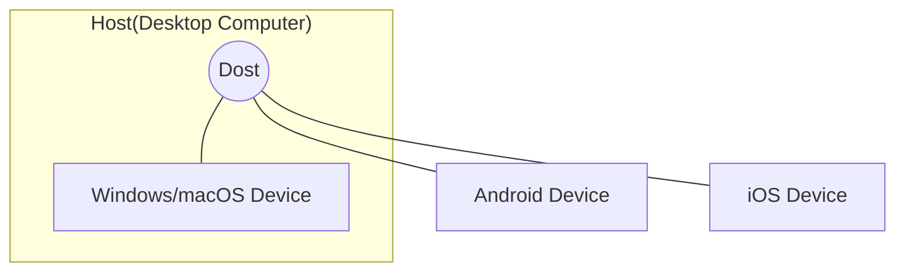

Dogu aims to manage devices on various platforms such as Windows, Mac, Android, and iOS in one place.
To realize this, we introduced the concept of `host` and `device`.

### Device {#device}

A `device` means a device with a platform such as Windows, Mac, Android, iOS, etc. Devices are not limited to the Desktop platform. It can be a desktop device or a mobile device.
Anything that can be controlled and orchestrated through software can be considered a device in Dogu.

Currently, Dogu supports Windows, Mac, and Android devices.

### Host and Dost {#host-and-dost}

`Dost` is a software that is installed on the Desktop Computer to help manage devices from the console, and the Desktop Computer where Dost is installed is called the `Host`.

It is not easy to connect and directly control mobile devices such as Android and iOS remotely.
However, most mobile devices support developer functions by connecting to desktop computers, and if you use tools such as adb or xcode, you can perform desired functions to some extent.

Therefore, Dogu developed Dost to manage mobile devices through Desktop Computer.
Users can install Dost on the desktop computer to manage desktop devices from the console.
Also, by connecting the mobile device to a desktop computer with Dost installed, the mobile device can also be managed from the console.

Currently, Dost supports Windows and Mac platforms.

### Host device

The host can also be used as a device. You can use the host as a device to test games on the `Windows` and `Mac` platforms.

You can find instructions on how to use the host as a device in the [Managing Host](/organization-and-project/organization/host) section.

### Diagram

 

:::info
[Start Dost](host/get-started)  
[Set up your device](device/settings)

Check out the above documents to start controlling your device.
:::
