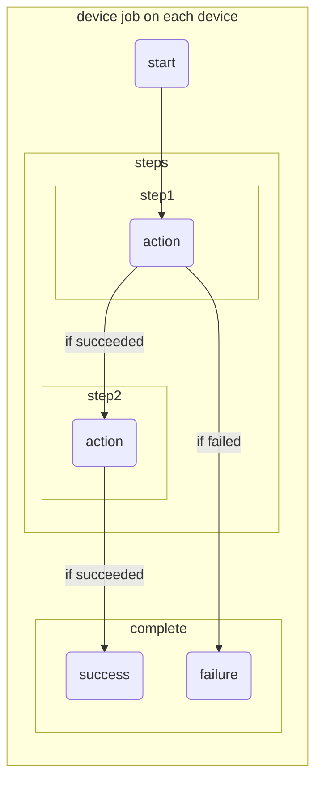

# Action

The execution unit described under 'steps' in 'Tasks' is 'steps'. 
And each step executes an 'action'. 
Actions can run [Execute Shell Script](./run) or [Predefined Actions](/routine/actions/predefined-actions). 

:::info
The action runs on the 'host' that is connected to the 'device' and controls the 'device'.
:::

### Flow

