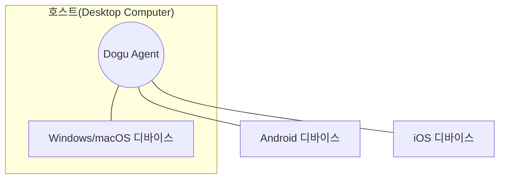

import HostAndAgent from '@site/src/components/device-farm/HostAndAgentKor.mdx';

Dogu는 Windows, Mac, Android, iOS 등의 다양한 플랫폼의 기기를 하나의 장소에서 관리하는 것을 지향합니다.
이를 실현하기 위해 `호스트`와 `디바이스`라는 개념을 도입했습니다.

### 디바이스 {#device}

`디바이스`는 Windows, Mac, Android, iOS 등의 플랫폼를 가진 기기 하나를 의미합니다. 디바이스는 Desktop 플랫폼에 한정되지 않습니다. Desktop 기기 일 수도 있고 Mobile 기기 일 수도 있습니다.
소프트웨어를 통해 제어 및 오케스트레이션이 가능하다면 Dogu에서는 모두 디바이스로 여겨질 수 있습니다.

현재 Dogu에서는 Windows, Mac, Android 기기를 지원합니다.

<HostAndAgent />

### Diagram

 

:::info
[Agent 설치하기](host)  
[디바이스 설정하기](device/settings)

위 문서들을 확인하여 디바이스 제어를 시작해보세요.
:::
