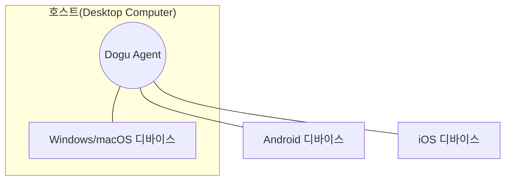

Dogu는 Windows, Mac, Android, iOS 등의 다양한 플랫폼의 기기를 하나의 장소에서 관리하는 것을 지향합니다.
이를 실현하기 위해 `호스트`와 `디바이스`라는 개념을 도입했습니다.

### 디바이스 {#device}

`디바이스`는 Windows, Mac, Android, iOS 등의 플랫폼를 가진 기기 하나를 의미합니다. 디바이스는 Desktop 플랫폼에 한정되지 않습니다. Desktop 기기 일 수도 있고 Mobile 기기 일 수도 있습니다.
소프트웨어를 통해 제어 및 오케스트레이션이 가능하다면 Dogu에서는 모두 디바이스로 여겨질 수 있습니다.

현재 Dogu에서는 Windows, Mac, Android 기기를 지원합니다.

### 호스트와 Dogu Agent {#host-and-agent}

`Dogu Agent`는 Desktop Computer에 설치되어 디바이스를 콘솔에서 관리할 수 있도록 도와주는 소프트웨어이며, Dogu Agent가 설치된 Desktop Computer를 `호스트`라고 부릅니다.

Android, iOS와 같은 Mobile 디바이스들은 원격에서 연결하여 직접 제어하는 것이 쉽지 않습니다.
하지만 Mobile 디바이스들은 대부분 Desktop Computer에 연결하여 개발자 기능을 수행할 수 있도록 지원하며 adb나 xcode와 같은 툴을을 사용한다면 어느정도는 원하는 기능을 수행할 수 있습니다.

따라서 Dogu에서는 Desktop Computer를 통해 Mobile 디바이스를 관리할 수 있도록 Dogu Agent를 개발했습니다.
사용자는 Desktop Computer에 Dogu Agent를 설치하여 Desktop 디바이스들을 콘솔에서 관리할 수 있고,
또한 Dogu Agent가 설치된 Desktop Computer에 Mobile 디바이스를 연결하여 Mobile 디바이스도 콘솔에서 관리할 수 있습니다.

현재 Dogu Agent는 Windows, Mac 플랫폼를 지원합니다.

### 호스트 디바이스

호스트 또한 디바이스로 사용할 수 있습니다. `Windows`, `Mac` 플랫폼에서 테스트를 진행하기 위해 호스트를 디바이스로 사용할 수 있습니다.

호스트를 디바이스로 사용하는 방법은 [호스트 관리](/management/organization/host)에서 확인할 수 있습니다.

### Diagram

 

:::info
[Agent 설치하기](host)  
[디바이스 설정하기](device/settings)

위 문서들을 확인하여 디바이스 제어를 시작해보세요.
:::
