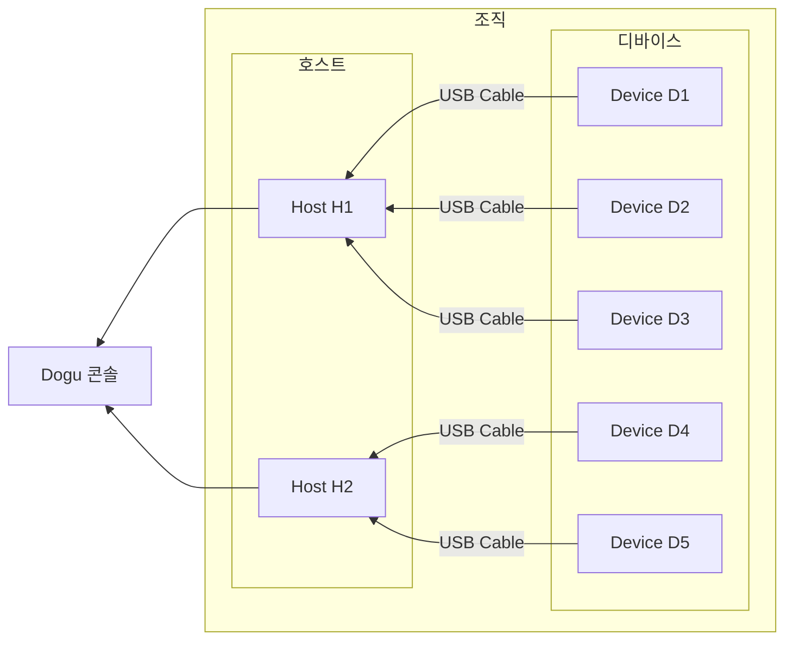

이 문서는 호스트 추가부터 디바이스 연결까지 설명합니다.

## 준비사항

게임 테스트를 실행하기 위해서는 아래 항목이 필요합니다.

1. Windows 또는 Mac 운영체제의 데스크탑 또는 노트북 1대
2. 안드로이드 디바이스 1대
3. USB 허브 및 안드로이드 디바이스 용 데이터 전송 케이블

## 조직과 프로젝트 생성하기

### 조직 생성하기

1. 콘솔에 로그인 또는 회원가입을 완료합니다.
   - 이메일 인증을 받지 않은 경우, 이메일 인증을 먼저 완료해 주세요.
2. "내 조직" 페이지로 이동합니다.
   - 이미 기존 조직 페이지에 있는 경우, 상단 헤더 메뉴의 프로필 이미지 -> "모든 조직" 메뉴를 클릭합니다.
     
3. "새 조직" 버튼을 클릭합니다.
4. 조직 이름을 입력하고 생성을 완료합니다.
   

### 프로젝트 생성하기

1. 조직 페이지에서 왼쪽 사이드바에 "프로젝트" 메뉴를 클릭합니다.
2. "새 프로젝트 생성" 버튼을 클릭합니다.
   
3. 프로젝트 이름과 설명을 입력 후 프로젝트 생성을 완료합니다
   

 

:::note

프로젝트를 생성하면, 프로젝트에 샘플 테스트 스크립트 환경이 제공됩니다. 이는 [게임 테스트 자동화 시작하기](../game-test) 단계에서 사용합니다.

:::

## 인프라 구축하기

Dogu에서는 **호스트**와 **디바이스**가 존재합니다.
호스트란, 여러 디바이스에 테스트를 적용하기 위해 허브 역할을 하는 장치입니다. 디바이스는 게임 테스트를 수행하는 실제 기기를 뜻합니다. 호스트와 디바이스를 연결하기 위해서, 실제 디바이스를 호스트에 물리적으로 연결해 주세요.

이 문서에서는 호스트 1대, 디바이스 1대를 기준으로 설명합니다.

:::info 디바이스 설정

디바이스를 원할하게 사용하려면, [디바이스 설정](/device-farm/device/settings) 문서를 읽고 디바이스 설정을 변경해 주세요.

:::

### 안드로이드 디바이스 연결하기

1. 설정이 완료된 디바이스를 준비합니다.
2. 호스트에 안드로이드 디바이스를 데이터 전송이 가능한 케이블 또는 허브를 통해 물리적으로 연결합니다.

:::caution 테스트 디바이스 플랫폼

현재 Dogu는 안드로이드 디바이스에서의 게임 테스트만 지원합니다.
iOS, Windows 디바이스는 추후 업데이트할 예정입니다.

:::

## 호스트 추가하기

:::info Prerequisites

1. [Dost 다운로드](https://dogutech.io/downloads/dost)에서 호스트 장비에 맞는 플랫폼을 선택해 최신 Dost 프로그램을 설치하세요.
2. 호스트 장비 권장 사양은 [Dost 시작하기](/device-farm/host/get-started) 문서를 참고하세요.

:::

1. 콘솔에서 조직 내 왼쪽 사이드바에서 호스트 메뉴를 클릭합니다.
   
2. 호스트 추가 버튼을 클릭하고 호스트 이름을 입력 후 생성을 완료합니다.
   
3. 발급받은 호스트 토큰을 복사 후, Dost의 토큰 입력창에 복사한 토큰을 붙여 넣어 연결을 완료합니다.
   
   
4. 콘솔에서 생성한 호스트의 상태가 "Connected" 상태가 되면 호스트 등록이 완료되었습니다.
   

:::info 자세히 알아보기

Dost와 호스트에 대한 자세한 내용은 [호스트](/device-farm/host/get-started) 문서를 참고하세요.

:::

---

호스트 추가 과정에 문제가 있나요? [호스트 트러블슈팅](/device-farm/host/trouble-shooting) 문서를 참고해 보세요.

## 디바이스 추가하기

디바이스를 추가하고 태그로 묶어 디바이스 팜을 구축합니다. 추가된 디바이스는 게임 테스트 수행 및 원격제어 등의 작업을 수행할 수 있습니다.

### 디바이스 사용하기

1. 콘솔에서 조직 내 왼쪽 사이드바에서 디바이스 메뉴를 클릭하고 "대기중인 디바이스" 탭을 클릭합니다.
2. 사용할 디바이스의 메뉴 버튼(`···`)을 클릭 후 "사용하기" 메뉴를 클릭하세요.
   
3. 추가할 디바이스를 사용할 프로젝트를 선택 후, 추가를 완료해줍니다.
   
4. "사용중인 디바이스" 탭을 클릭해 디바이스가 추가되었는지 확인합니다.
   

:::caution 권한 및 퍼블릭 디바이스

Dogu 콘솔에는 조직 내 권한 기능이 있습니다. 권한 기능을 이용해 게임 테스트 결과를 보거나, 디바이스에 접근할 수 있는 멤버를 자유롭게 지정하세요.

퍼블릭 디바이스의 경우에는 모든 멤버 또는 모든 프로젝트에서 해당 디바이스에 접근(스트리밍 및 원격제어, 테스트 실행 등)이 가능합니다.

권한 기능에 대해서는 [권한 시스템](/management/organization/permission) 문서를 참고하세요
:::

:::info 더 알아보기

디바이스 추가와 관련한 더 자세한 설명은 [조직 디바이스 관리](/management/organization/device/device-management#디바이스-추가하기) 문서를 참고하세요.

:::

---

디바이스 추가 과정에 문제가 있나요? [디바이스 트러블슈팅](/device-farm/device/trouble-shooting) 문서를 참고해 보세요.

### 디바이스 태그 붙이기

디바이스 태그를 통해 디바이스를 그룹화하고 테스트를 실행할 수 있습니다.

:::tip 기본 태그

디바이스를 사용할 때 기본적으로 디바이스의 플랫폼 태그가 붙습니다.

:::

1. 콘솔에서 조직 내 왼쪽 사이드바에서 디바이스 메뉴를 클릭합니다.
2. 태그를 붙일 디바이스의 메뉴 버튼(`···`)을 클릭하고, "태그 변경" 메뉴를 클릭합니다.
   
3. 생성할 태그 이름을 입력하고, 태그 만들기 버튼을 클릭합니다.
   
4. 모달을 닫고, 디바이스에 태그가 추가되었는지 확인합니다.
   

:::info 더 알아보기

디바이스 태그 관련 더 자세한 정보는 [조직 디바이스 태그 관리](/management/organization/device/tag-management) 문서를 참고하세요.

:::

### 디바이스 스트리밍하기

추가된 디바이스는 스트리밍 또는 원격 제어 기능을 사용할 수 있습니다.

1. 콘솔에서 조직 내 왼쪽 사이드바에서 디바이스 메뉴를 클릭합니다.
2. 스트리밍할 디바이스의 메뉴 버튼(`···`)을 클릭하고, "스트리밍" 메뉴를 클릭합니다.
   
3. 디바이스 스트리밍이 시작되었습니다. 화면을 클릭하거나, 드래그하여 디바이스를 원격 제어할 수 있습니다.
   

## 마치며

디바이스 팜 구축이 완료되었습니다. 이제 추가된 디바이스는 Dogu 콘솔에서 관리할 수 있습니다.

디바이스 화면 실시간 스트리밍 및 원격제어, 디바이스 태그, 디바이스 프로젝트 할당 기능 등을 이용해 조직 내에서 자유롭게 디바이스를 관리해 보세요.

- 디바이스 스트리밍 및 원격 제어는 [디바이스 원격 제어](/device-farm/device/streaming-and-remote-control/about) 문서를 참고하세요.
- 디바이스 관리 기능에 대해서는 [디바이스 관리](/management/organization/device/device-management) 문서를 참고하세요.
- 디바이스 태그 관리 기능에 대해서는 [디바이스 태그 관리](/management/organization/device/tag-management) 문서를 참고하세요.
