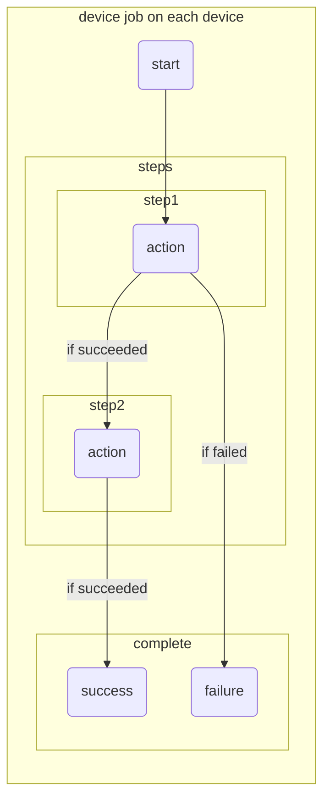

# 액션

`작업`에서 `steps` 하위에 기술하는 실행 단위는 `스텝`입니다. 
그리고 각 스텝은 `액션`을 실행합니다. 
액션은 [쉘 스크립트 실행](./run) 또는 [미리 정의된 액션](/routine/actions/predefined-actions)을 실행할 수 있습니다. 

:::info
액션은 `디바이스`와 연결되어 있는 `호스트`에서 실행되고, `디바이스`를 제어합니다.
:::

### 흐름도

